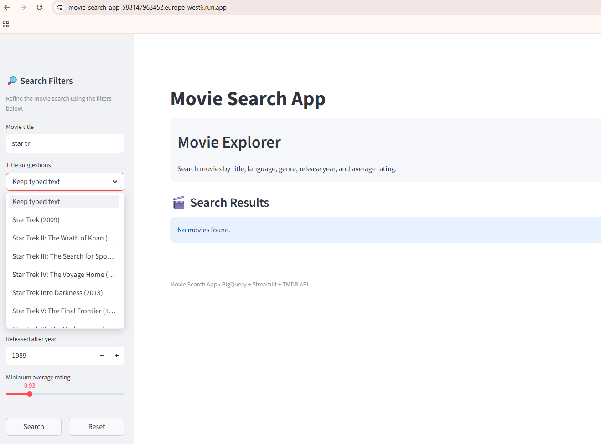
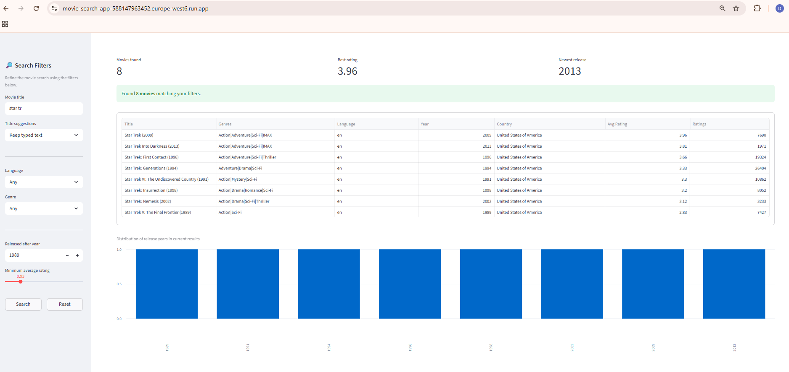
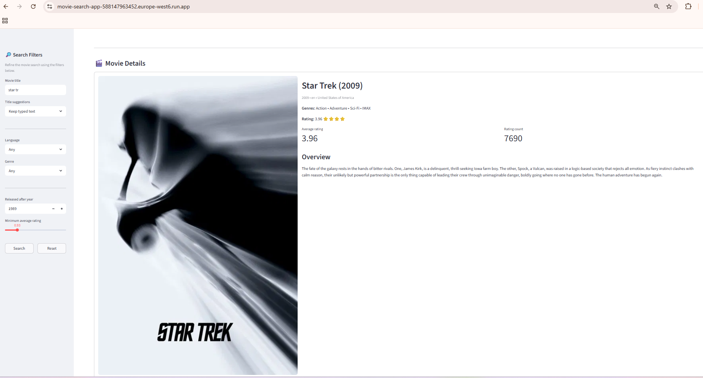

Movie Search App (BigQuery + Streamlit)

A cloud-based movie search application that allows users to explore a movie database using filters and view enriched movie details retrieved from The Movie Database (TMDB) API.

The application runs on Google Cloud Run and queries movie data stored in Google BigQuery. It provides an interactive interface built with Streamlit.

Project Overview
| Component        | Technology       |
| ---------------- | ---------------- |
| User Interface   | Streamlit        |
| Database         | Google BigQuery  |
| Query Language   | SQL              |
| External API     | TMDB             |
| Containerization | Docker           |
| Deployment       | Google Cloud Run |

Live Application
https://movie-search-app-588147963452.europe-west6.run.app

Features
Search functionality

Users can search movies using several filters:

Movie title (with autocomplete suggestions)

Language filter

Genre filter

Release year filter

Minimum average rating filter

Results display

Search results include:

Results table

Number of movies found

Best rating metric

Newest movie metric

Release year distribution chart

Movie details panel

When a movie is selected, the application displays:

Movie poster

Overview description

Genres

Language and country

Release year

Average rating

Number of ratings

External API integration

The application uses the TMDB API to retrieve:

Movie posters

Movie descriptions

Architecture Diagram
                +------------------+
                |   User Browser   |
                |   (Streamlit UI) |
                +---------+--------+
                          |
                          ▼
                +------------------+
                |   Cloud Run      |
                |  Streamlit App   |
                |  Python Backend  |
                +---------+--------+
                          |
                          ▼
                +------------------+
                |    BigQuery      |
                | Movies + Ratings |
                +---------+--------+
                          |
                          ▼
                +------------------+
                |    TMDB API      |
                | Poster + Overview|
                +------------------+

                +------------------+
                |   User Browser   |
                |   (Streamlit UI) |
                +---------+--------+
                          |
                          ▼
                +------------------+
                |   Cloud Run      |
                |  Streamlit App   |
                |  Python Backend  |
                +---------+--------+
                          |
                          ▼
                +------------------+
                |    BigQuery      |
                | Movies + Ratings |
                +---------+--------+
                          |
                          ▼
                +------------------+
                |    TMDB API      |
                | Poster + Overview|
                +------------------+

Repository Structure
movie-search-app/
│
├── app/
│   ├── main.py
│   ├── config.py
│   ├── bq_client.py
│   ├── queries.py
│   │
│   ├── services/
│   │   ├── movie_service.py
│   │   └── external_api_service.py
│   │
│   ├── ui/
│   │   ├── search_panel.py
│   │   ├── results_panel.py
│   │   └── details_panel.py
│   │
│   └── utils/
│       ├── helpers.py
│       └── logger.py
│
├── data/
│   └── sample_schema_notes.md
│
├── screenshots/
│   ├── search-interface.png
│   ├── search-results.png
│   └── movie-details.png
│
├── tests/
│   ├── test_queries.py
│   └── test_helpers.py
│
├── Dockerfile
├── requirements.txt
├── cloudbuild.yaml
└── README.md

Dataset

Two datasets are used: movies table and ratings table (uploaded to Google Cloud Storage before importing into BigQuery):

Movies Table
| Column       | Description             |
| ------------ | ----------------------- |
| movieId      | Unique movie identifier |
| title        | Movie title             |
| genres       | Movie genres            |
| tmdbId       | TMDB identifier         |
| language     | Movie language          |
| release_year | Year of release         |
| country      | Country of production   |

Ratings Table
| Column    | Description      |
| --------- | ---------------- |
| userId    | User identifier  |
| movieId   | Movie identifier |
| rating    | Rating value     |
| timestamp | Rating timestamp |

BigQuery SQL Queries

The application executes SQL queries to retrieve movie information and compute aggregated ratings.

Example query:

SELECT
    m.movieId,
    m.title,
    m.genres,
    m.language,
    m.release_year,
    m.country,
    AVG(r.rating) AS avg_rating,
    COUNT(r.rating) AS rating_count
FROM `bigquery-movie-search.movies_app.movies` m
LEFT JOIN `bigquery-movie-search.movies_app.ratings` r
ON m.movieId = r.movieId
GROUP BY m.movieId, m.title, m.genres, m.language, m.release_year, m.country

Executed SQL queries are printed in the terminal for debugging.

Instructions to Use the Application

Enter a movie title in the search field.

Use the filters in the sidebar:

Language

Genre

Release year

Minimum average rating

Click Search.

Browse the results table.

Select a movie from the dropdown to view full details.

Displayed details include:

movie poster

movie overview

average rating

rating count

genre information

Running the Application Locally
Install dependencies
pip install -r requirements.txt
Create environment variables

Create a .env file:

GOOGLE_CLOUD_PROJECT=your_project_id
BQ_DATASET=movies_app
TMDB_API_KEY=your_tmdb_api_key
Run the application
streamlit run app/main.py

Docker

The application is containerized using Docker.

Build the container
docker build -t movie-search-app .
Run the container
docker run -p 8080:8080 movie-search-app

Cloud Deployment

The application is deployed to Google Cloud Run.

Deployment command:

gcloud run deploy movie-search-app \
--source . \
--region europe-west6 \
--allow-unauthenticated

Environment variables are configured directly in Cloud Run.

Screenshots

Application preview:

# Screenshots

### Search Interface

### Search Results

### Movie Details

The interface includes:

search filters sidebar

results table

movie poster

overview

rating metrics

release year chart

Key Implementation Decisions
Modular architecture

The application separates logic into services, UI components, and database access modules to improve maintainability and scalability.

BigQuery for large datasets

Ratings data (~520MB) and movies data are stored in BigQuery to efficiently execute SQL queries on large datasets.

Streamlit for UI development

Streamlit enables rapid development of interactive data exploration interfaces.

Cached dropdown queries

Language and genre lists are cached using st.cache_data to avoid repeated database queries.

External API integration

TMDB API enriches the dataset with additional movie information such as posters and descriptions.

Technologies Used

Python

Streamlit

Google BigQuery

Google Cloud Run

Docker

TMDB API

Pandas